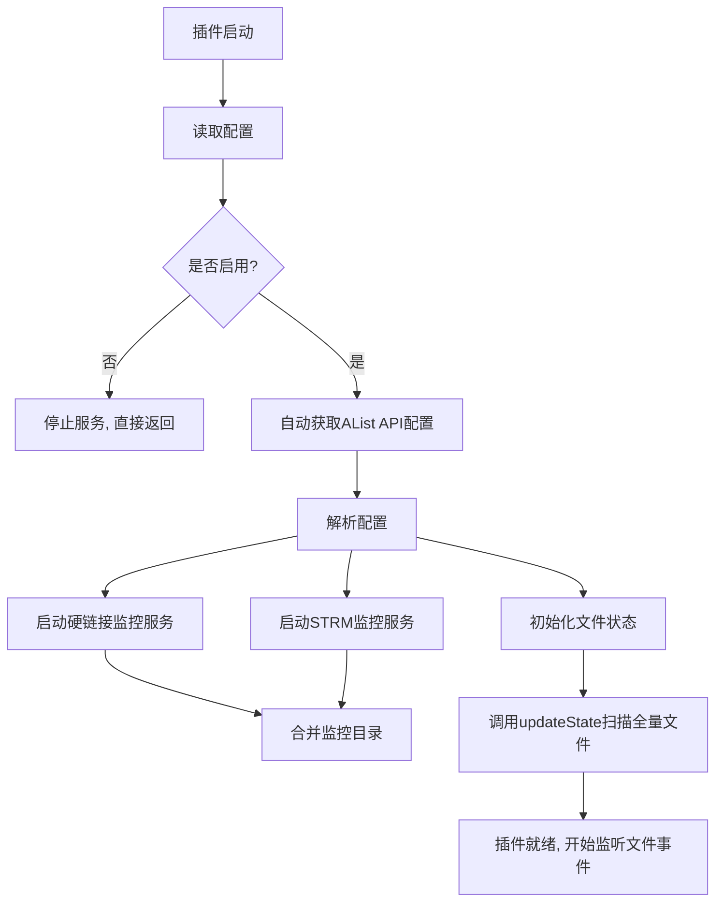
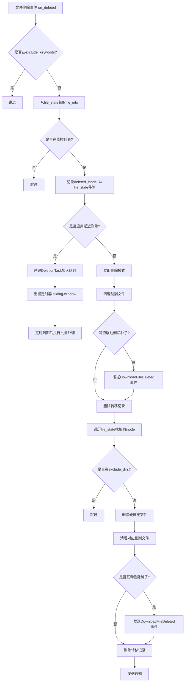
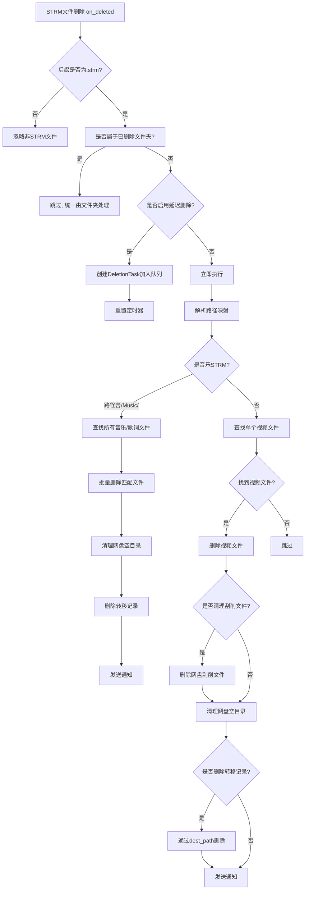
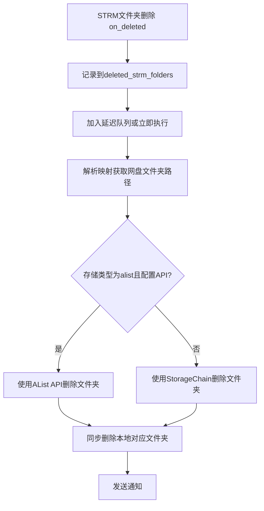
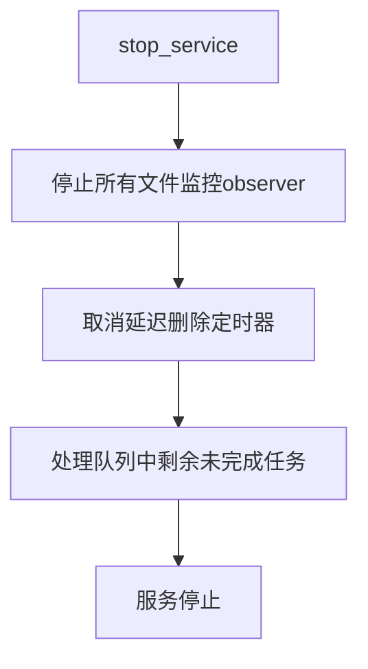

# 清理媒体文件插件 (RemoveLink) - 运作流程文档

## 一、插件概述

插件名称：**清理媒体文件** (RemoveLink v3.0)

作者：Lyzd1, DzAvril

这是一款全面的媒体文件清理工具，支持两种核心工作模式（**硬链接清理** 和 **STRM文件清理**），可独立启用或同时启用。同时支持刮削文件清理、转移记录清理、种子联动删除、空目录清理等辅助功能。

---

## 二、核心数据结构

### 2.1 FileInfo
```python
FileInfo(inode: int, add_time: datetime)
```
- **inode**: 文件inode号，用于在文件系统中唯一标识一个文件
- **add_time**: 文件被加入监控的时间

### 2.2 DeletionTask
```python
DeletionTask(file_path: Path, timestamp: datetime, task_type: str, deleted_inode: Optional[int], processed: bool)
```
- **task_type**: 任务类型，取值为 `"hardlink"`、`"strm"`、`"strm_folder"`
- **processed**: 标记任务是否已被处理
- **deleted_inode**: 仅 hardlink 任务使用

### 2.3 DeletionResult
```python
DeletionResult(file_path, task_type, success, storage_type, storage_path, scrap_deleted, dirs_deleted, history_deleted, hardlink_count)
```

---

## 三、插件启动流程 (`init_plugin`)



### 启动步骤详述：
1. **读取配置**：从 `config` 读取所有用户配置项
2. **自动配置AList API**：如果开启了 AList API 空目录清理但未填URL/Token，自动从 MoviePilot 系统存储配置中读取第一个 `alist`/`openlist` 类型的存储配置
3. **启动硬链接监控**：为每个 `monitor_dirs` 中的目录创建 `FileMonitorHandler(monitor_type="hardlink")`，使用系统最优的文件系统监控器（Linux: inotify, macOS: FSEvents, Windows: ReadDirectoryChanges, 回退: PollingObserver）
4. **启动STRM监控**：从 `strm_path_mappings` 中解析出 STRM 目录，为每个目录创建 `FileMonitorHandler(monitor_type="strm")`
5. **初始化文件状态**：调用 `updateState()` 遍历所有监控目录，记录每个文件的路径和 inode 信息到 `file_state` 字典

---

## 四、硬链接清理模式完整流程

### 4.1 核心原理

利用 **inode** 来识别硬链接关系。多个硬链接文件共享同一个 inode。当监控到一个文件被删除时，通过 inode 匹配找到其他所有同 inode 的硬链接文件一并删除。

### 4.2 事件处理流程



### 4.3 延迟删除模式详细

延迟删除采用 **滑动窗口（sliding window）机制**：
- 每次新任务加入队列，重置定时器
- 定时器到期后，一次性处理队列中所有未处理的任务
- 处理时分别验证：
  1. **文件是否被重新创建**：如果文件重新存在，跳过
  2. **是否重新硬链接**：检查是否有相同 inode 的新文件在删除后被添加到监控（添加时间 > 删除时间），如果存在则说明系统重新做了硬链接，跳过删除
- 处理完成后发送批量通知

### 4.4 文件移动事件

`on_moved` 事件处理：
- 从 `file_state` 中移除源路径
- 将目标路径添加到 `file_state`

### 4.5 文件夹删除事件

`on_deleted` 对文件夹的处理：
- 当监控到文件夹被删除时，如果启用了 `_delete_torrents`，发送 `DownloadFileDeleted` 事件以联动删除种子

---

## 五、STRM文件清理模式完整流程

### 5.1 核心原理

监控 STRM 文件（.strm 后缀）的删除事件，通过 **路径映射配置** 找到对应的网盘文件，然后删除网盘文件及相关刮削文件和空目录。

### 5.2 路径映射格式

```
STRM目录:存储类型:网盘目录[:本地存储类型:本地目录]
```

示例：
- `/ssd/strm:u115:/media` — STRM文件删除后删除 115 网盘上对应文件
- `/nas/strm:alipan:/阿里云盘/媒体:alistlocal:/mnt/local_media` — 同时通过 AList API 删除本地挂载目录
- `/strm:alist:/YP/Music:alistlocal:/mnt/music`

**支持的存储类型**：`local`（本地）、`alipan`（阿里云盘）、`u115`（115网盘）、`rclone`、`alist`（Alist挂载）

### 5.3 STRM文件删除事件处理



### 5.4 STRM文件夹删除事件处理



**关键点**：当文件夹被删除时，该文件夹内的所有文件删除事件都会被 `deleted_strm_folders` 集合过滤，避免重复处理。集合中的路径在延迟删除处理完成后被移除。

---

## 六、辅助功能

### 6.1 刮削文件清理 (`delete_scrap_infos`)

- 受 `_delete_scrap_infos` 开关控制
- 删除与被删视频文件同前缀的：`.nfo`, `.xml`, `.jpg`, `.jpeg`, `.png`, `.webp`, `.tbn`, `.fanart`, `.gif`, `.bmp`（元数据/图片）, `.srt`, `.ass`, `.ssa`, `.sub`, `.idx` 等（字幕文件）
- 对于网盘（STRM模式），还会删除 `poster.jpg`, `backdrop.jpg`, `fanart.jpg`, `banner.jpg`, `logo.png` 等媒体库专用文件

### 6.2 空目录清理 (`delete_empty_folders`)

- 从被删文件所在目录**逐级向上**检查
- 仅当目录为空或只剩刮削文件时才删除
- 到达监控目录根或排除目录时停止
- 对于 STRM 模式，支持使用 **AList API** 删除网盘空目录（比 StorageChain 更彻底）
- 同时支持 **本地目录同步删除**（通过 `alistlocal` 映射配置）

### 6.3 转移记录清理 (`delete_history`)

- 通过 `TransferHistoryOper` 操作数据库
- 硬链接模式下通过源路径 (`get_by_src`) 查找
- STRM 模式下通过目标路径 (`get_by_dest`) 查找

### 6.4 种子联动删除 (`delete_torrents`)

- 发送 `EventType.DownloadFileDeleted` 事件
- 需要配合 **[下载器助手]** 插件使用，并开启监听源文件事件

---

## 七、文件监控器 (`FileMonitorHandler`)

继承自 `watchdog.events.FileSystemEventHandler`，处理四类事件：

| 事件 | 行为 |
|------|------|
| `on_created` | 将新文件添加到 `file_state` |
| `on_moved` | 从 `file_state` 移除源路径，添加目标路径 |
| `on_deleted` | 根据监控类型路由到 `handle_deleted` (hardlink) 或 `handle_strm_deleted`/`handle_strm_folder_deleted` (strm) |
| `on_deleted`(文件夹-STRM) | 直接清理网盘对应文件夹 |

**排除机制**：
- 临时文件后缀：`.!qB`, `.part`, `.mp`, `.tmp`, `.temp`
- 关键词过滤：通过 `exclude_keywords` 配置

---

## 八、延迟删除机制

### 滑动窗口算法 (`sliding window`)
1. 每次收到删除事件，创建 `DeletionTask` 加入 `deletion_queue`
2. 重置定时器（取消旧定时器，创建新的 `threading.Timer`）
3. 定时器到期后调用 `_process_deletion_queue`
4. 一次性处理队列中所有**未处理**的任务
5. 发送批量通知
6. 清理已处理任务

### 优势
- 合并连续的删除操作，避免频繁触发
- 给用户缓冲时间，防止误操作
- 验证：延迟到期后会再次检查文件是否重新创建，避免媒体重整理导致的误删

### 延迟时间范围
- 最小 10 秒，最大 300 秒，默认 30 秒

---

## 九、服务停止流程 (`stop_service`)



停止服务时会**强制处理**队列中剩余的删除任务，确保不丢失。

---

## 十、通知系统

| 模式 | 通知类型 | 说明 |
|------|---------|------|
| 硬链接立即删除 | 单条通知 | 包含源文件、硬链接文件、刮削/记录/种子信息 |
| STRM立即删除 | 单条通知 | 包含STRM文件、网盘文件、刮削/目录/记录信息 |
| 音乐STRM立即删除 | 单条通知 | 包含音乐文件数量信息 |
| 批量延迟删除 | 汇总通知 | 分类列出STRM文件/文件夹/硬链接，汇总统计信息 |
| 空目录清理 | 站内信 | 每次清理空目录时发送 |

---

## 十一、配置项总览

| 配置项 | 类型 | 默认值 | 说明 |
|--------|------|--------|------|
| `enabled` | bool | false | 启用插件 |
| `notify` | bool | false | 发送通知 |
| `monitor_dirs` | text | "" | 硬链接监控目录（每行一个） |
| `exclude_dirs` | text | "" | 不删除目录（每行一个） |
| `exclude_keywords` | text | "" | 排除关键词（每行一个） |
| `delete_scrap_infos` | bool | false | 清理刮削文件 |
| `delete_torrents` | bool | false | 联动删除种子 |
| `delete_history` | bool | false | 删除转移记录 |
| `delayed_deletion` | bool | true | 启用延迟删除 |
| `delay_seconds` | int | 30 | 延迟时间(秒) 10-300 |
| `monitor_strm_deletion` | bool | false | 启用STRM监控 |
| `strm_path_mappings` | text | "" | STRM路径映射 |
| `api_delete_empty_dirs` | bool | false | AList API删除空目录 |
| `api_delete_url` | text | "" | AList URL |
| `api_delete_token` | text | "" | AList Token |
